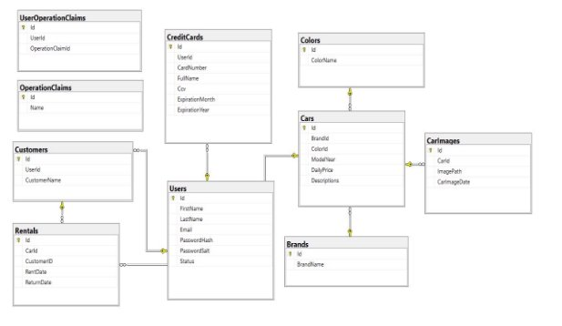
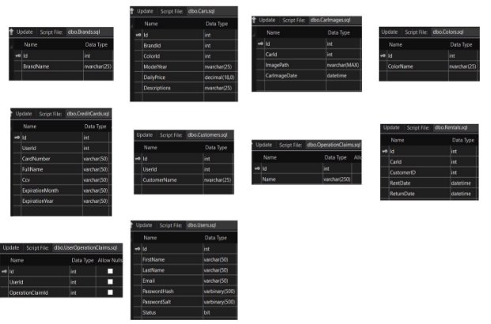
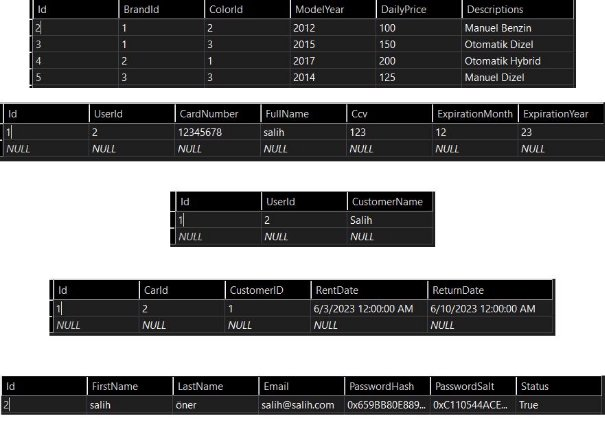
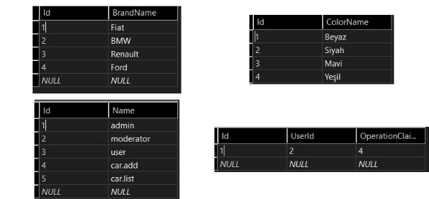

**CAR RENTAL** 

**Proje Konusu ve Amacı** 

- **Projenin Konusu** 

*Bu proje, araç kiralama hizmetlerini çevrimiçi olarak sunan bir web sitesi geliştirmeyi hedeflemektedir. Bu platform, kullanıcılara istedikleri zaman ve yerde araç kiralama hizmetine erişim sağlar. Sistemin temel özellikleri arasında çeşitli araçlar arasından seçim yapabilme, araçları kiralayabilme ve ödeme yapabilme özellikleri bulunmaktadır.* 

*Web sitesi, kullanıcıların gereksinimlerine ve bütçelerine en uygun olanı bulmalarına yardımcı olmak için farklı renk, marka ve modeldeki araçları sunmaktadır. Kullanıcılar araçları, belirli bir tarih ve süre için doğrudan platform üzerinden kiralayabilirler. Üyelik sistemine sahip olan bu platformda, kullanıcılar üye olduktan sonra kendi profillerini oluşturabilir ve kiralama işlemlerini gerçekleştirebilirler.* 

*Kredi kartı ödeme sistemi entegrasyonu sayesinde, kullanıcılar kiraladıkları araç için ödeme yapabilirler.*  

- **Projenin Amacı** 

*Bu projenin ana amacı, kullanıcılara çevrimiçi bir araç kiralama hizmeti sunmaktır. Bu hizmet, kullanıcıların istedikleri zaman ve yerde ihtiyaç duydukları bir araç kiralayabilmesini sağlar.* 

*Ayrıca, bu proje, kullanıcıların kiralama sürecini hızlandırmayı ve kolaylaştırmayı hedefler. Üyelik ve ödeme sistemlerini entegre ederek, kullanıcıların tek bir platform üzerinden hem araç kiralama hem de ödeme yapabilmelerini sağlar. Bu, kiralama sürecini daha hızlı ve daha kullanıcı dostu hale getirir.* 

*Son olarak, bu proje, araç kiralama endüstrisindeki dijital dönüşümü hızlandırmayı hedeflemektedir. Web sitesi, kullanıcıların kendi evlerinin rahatlığında araç kiralama hizmetlerine erişmelerine olanak sağlar. Bu da araç kiralama deneyimini daha rahat ve daha erişilebilir hale getirir.* 

**Projede Kullanılan Yöntem, Teknik ve Araçlar** 

**BACK-END;** 

- **Yöntem** 

*Proje, katmanlı mimari yaklaşımını kullanarak geliştirilmiştir. Bu, uygulamanın farklı yönlerinin birbirinden bağımsız olarak geliştirilebilmesi ve sürdürülebilmesi için kullanılır. İyi tasarlanmış bir katmanlı mimari, kodun yeniden kullanılabilirliğini artırır, testi kolaylaştırır ve gelecekteki değişikliklere veya genişlemelere karşı daha esnek hale gelir.* 

- **Teknik** 

*Projede Solid Prensip ve Tasarım Desenleri kullanılmıştır. Solid Prensip, yazılım geliştirme sürecindeki temel prensiplerden bazılarıdır ve iyi tasarlanmış bir sistem oluşturmayı hedefler. Tasarım Desenleri ise çözümlemek için yaygın ve tekrar eden tasarım sorunlarına uygulanan çözümlerdir.* 

*Projede ayrıca .Net Core, Entity Framework ve Web Api gibi çeşitli teknolojiler ve araçlar kullanılmıştır:* 

1. *.Net Core: Açık kaynaklı bir platform olup, çok çeşitli uygulama türlerini geliştirmek için kullanılabilir. Bu proje için, ASP.NET Core Web API, HTTP protokolü üzerinden veri alışverişinde bulunacak bir back-end hizmeti oluşturmak için kullanılmıştır.* 
1. *Entity Framework: .NET için açık kaynaklı bir nesne-ilişkisel eşleme (ORM) çerçevesidir. Veritabanı işlemlerini daha kolay ve verimli bir şekilde gerçekleştirmek için kullanılır.* 
1. *Web API: HTTP hizmetlerini oluşturmak ve kullanmak için bir çerçevedir. Bu projede, uygulamanın back-end hizmetlerini sağlamak için kullanılmıştır.* 
- **Araçlar** 

*Projede, katmanlı mimari kullanılarak bir yapı oluşturulmuştur. Bu yapıda temel olarak beş katman mevcuttur: Entities, DataAccess, Business, Core ve WebApi katmanları. Her bir katmanda, Abstract ve Concrete olmak üzere iki ana klasör yer almaktadır. Abstract klasörü, soyut nesnelerin depolandığı bir klasördür. Burada genel olarak arayüzler, soyut sınıflar ve arayüzleri tanımlayan soyut metotlar bulunur. Concrete klasörü ise somut nesnelerin yer aldığı bir klasördür. Bu klasörde, soyut nesnelerden türetilen ve gerçek uygulamayı temsil eden somut sınıflar bulunur. Bu şekilde, projenin katmanlar arasında düzenli bir ayrımı ve soyutlamayı sağlanmış olur.* 

***Katmanlar;*** 

1. ***Entities***  
    1. *Projedeki veritabanı tablolarının karşılıklarını tutan bir katmandır. Her tablo için bir entity oluşturulması gerekmektedir. Ayrıca, farklı entitylerin bir araya gelerek oluşturduğu kendi nesnelerimizi Dto (Data Transfer Object) olarak da oluşturabilmekteyiz. Bu sayede verileri daha etkili bir şekilde transfer etmek ve işlemek için kullanabileceğimiz özel nesneler yaratmamız mümkündür.* 
    2. *Entities katmanı, veritabanı yapılarını temsil eden sınıfların ve bu sınıflarla ilişkili olan diğer nesnelerin yer aldığı bir katmandır. Bu şekilde, veritabanı tablolarının projedeki temsilcilerini düzenli bir şekilde tutarak, veri erişimi ve işlemlerini kolaylaştırırız.* 
2. ***DataAccess*** 
    1. *Entity Framework kullanarak veritabanı CRUD (Create, Read, Update, Delete) işlemlerini gerçekleştiren bir katmandır. Bu katman, Core ve Entity katmanlarına referans alırken diğer katmanlardan bağımsızdır.*  
    1. *Bu katman, veritabanıyla iletişimi sağlamak ve işlemleri yürütmek için Entity Framework'ü kullanır. Entity Framework, ORM (Object-Relational Mapping) aracılığıyla veritabanı tablolarını entity sınıflarıyla eşleştirir ve bu sınıflar üzerinden veritabanı işlemlerini gerçekleştirir.* 
    3. *DataAccess katmanı, Core katmanındaki iş mantığına uygun olarak veritabanı CRUD işlemlerini gerçekleştirir. Entity katmanındaki entity sınıflarını kullanarak veritabanı tablolarına erişir ve Entity Framework aracılığıyla CRUD işlemlerini gerçekleştirir.* 
    3. *Bu yapı sayesinde, DataAccess katmanı Core ve Entity katmanlarını referans alarak veritabanı işlemlerini düzenli bir şekilde yönetirken, diğer katmanlardan bağımsız kalır. Bu da projenin modülerliğini artırır ve kod organizasyonunu iyileştirir.* 
    3. *DataAccess katmanı, veritabanı işlemlerini sıkı bir şekilde kontrol altında tutar ve projenin farklı katmanları arasındaki bağımlılıkları minimize eder. Bu sayede, veritabanı işlemlerini daha kolay yönetebilir ve geliştirme sürecini daha etkin hale getirebiliriz.* 
3. ***Business*** 
    1. *Web API katmanı ile DataAccess katmanı arasında veri işleme sürecini yöneten bir katmandır. Bu katman, bir anlamda bu iki katman arasında bir köprü görevi üstlenir. Ayrıca, tüm doğrulama ve veri kontrolü işlemlerini gerçekleştirme sorumluluğunu üstlenir.* 
    2. *Bu katmanda birkaç önemli klasör bulunmaktadır: Abstract, Concrete, BusinessAspects , CSS, DependencyResolvers, ValidationRules ve Constants . Abstract klasörü, soyut nesnelerin tutulduğu bir klasördür. Bu klasörde, iş mantığına dair soyut sınıflar, arayüzler ve metotlar yer alır. Concrete klasörü ise soyut sınıflardan türetilmiş somut sınıfların tutulduğu klasördür. Bu klasörde, iş mantığına özgü uygulama ve operasyonları gerçekleştiren somut sınıflar bulunur.* 
        1. **DependencyResolvers:** *Projedeki IoC yönetimi burada yer almaktadır. Yani tüm instance yönetimi bu klasörde yer almaktadır. ( IoC , yazılım bileşenlerinin diğer bileşenlerin oluşturlması ve bağımlılıklarının yönetimi gibi işlemleri kendisi yerine bir üçüncü tarafın kontrol ettiği bir tasarım prensibidir.)* 
        2. **ValidationRules:** *Verilerin kontrol edildiği bir klasördür. Burada nesnelerin veri değerlerini ve kabul edilebilir aralıklarını tanımlarız. Örneğin, bir arabanın fiyat bilgisinin boş olamayacağını ve günlük fiyatının hangi aralıkta olabileceğini belirtebiliriz. Bu şekilde, veri doğrulama kurallarını bu klasörde tanımlayarak verilerin istenilen kriterlere uygun olmasını sağlarız.* 
        2. **CCC(Cross-cutting concern):** *Yazılım geliştirmede tekrar eden ve farklı bileşenleri etkileyen işlevlerdir. Bu işlevler, genellikle iş mantığından bağımsız olarak günlük kayıtları, hata yönetimi, kimlik doğrulama gibi işlemleri içerir.* 
        2. **Constants:** *Bu klasörde business katmanında kullandığımız değişmeyen değerleri tutuyoruz. Örneğin; Messages sınıfı.*
        2. **BusinessAspects:** *Autofac yapsını içerir. Autofac, .NET platformunda kullanılan bir DI (Dependency Injection) konteyneridir. Bu konteyner, bağımlılıkların yönetildiği ve bileşenlerin otomatik olarak enjekte edildiği bir yapı sağlar, böylece yazılım geliştirme sürecinde modüler ve esnek bir yaklaşım sunar.*
4. ***Core*** 

    *a.  Core katmanı, projenin temel çekirdek bileşenlerini içeren ve diğer katmanlara bağımlı olmayan bir yapıdır. Bu katman, Aspects, CrossCuttingConcerns, DataAccess, Entities, Extensions, Utilities ve DependencyResolver gibi klasörleri içerir.* 

    1. **Aspects:** *Cache, performance, Transaction ve validation işlemlerinin yani AOP işlemlerinin yapıldığı klasördür.* 
    1. **CrossCuttingConcers:** *CCC işlemlerinin yapıldığı klasördür. Cache ve validation işlemleri bulunur.* 
    3. **DataAccess:** *Bu katmanda DataAccess katmanında yer alan Temel interface yapıları ve EntityFramework için genel Base(temel) sınıf bulunmaktadır.* 
    3. **Entities:** *Birbirinden bağımsız tüm projelerde yer alacak genel interface ve ana sınıflar bulunmaktadır.* 
    3. **Extensions:** *Kullandığımız hazır sistemlere ek özelliklerin eklendiği klasördür.* 
    3. **DependencyResolver:** *Core katmanında yer alan sistemlerin instance yönetimini sağladığımız klasördür.* 
    3. **Utilities:** *Core katmanının belkide en önemli kısmı bu diyebiliriz. Tüm alt araçların yer aldığı bu klasörde, Helper sınıflar, Interceptors, IoC, Results ve Security klasörleri bulunmaktadır.*  
5. ***WebAPI*** 

    *a.  Bu katman, .Net Core Web Api projesi olarak yapılandırılmıştır ve API olarak erişilebilen hizmetleri bu katmanda yazmaktayız. Controller klasörü bu katmanda yer alır ve tüm controller'ları içerir. Ortak işlevlere sahip olduğu için ResponseControllerBase abstract sınıfı oluşturulmuştur ve tüm controller'lar bu sınıftan türetilir. Bu sayede ortak fonksiyonları kolayca paylaşabiliriz.* 

6. ***ConsoleUI*** 

    *a.  Projemizin çalışıp çalışmadığının kontrolü ve test işlemleri için oluşturmuş olduğum Console modülü.* 

**FRONT-END;** 

- **Yöntem** 

*i)**Component Tabanlı Geliştirme:** Angular, komponent tabanlı bir yapı sunar. Bu sayede uygulama parçalarını (component) oluşturarak her bir parçayı bağımsız bir şekilde geliştirebilir ve daha sonra bir araya getirerek tamamlanmış bir uygulama oluşturabilirsiniz.* 

- **Teknik**

    1) **TypeScript:** *Angular, JavaScript tabanlı olarak TypeScript programlama dilini kullanır. TypeScript, statik tip kontrolü, nesne yönelimli programlama özellikleri ve gelişmiş IDE desteği gibi avantajlar sunar. Bu sayede daha güvenli, anlaşılır ve bakımı kolay kodlar yazabilirsiniz.* 
    9) **Reactive Programming:** *Angular, Reactive Extensions (RxJS) kütüphanesini kullanarak reaktif programlama yaklaşımını destekler. Bu sayede olay tabanlı ve asenkron işlemleri daha kolay yönetebilir, veri akışlarını işleyebilir ve bileşenler arası iletişimi sağlayabilirsiniz.* 
    9) **Modülerlik:** *Angular, modüler bir yapıya sahiptir. Bu sayede uygulamanızı farklı modüllere ayırabilir ve ihtiyaç duyduğunuzda bu modülleri kullanabilirsiniz. Modülerlik, kodun yeniden kullanılabilirliğini artırır ve uygulamanın daha iyi bir şekilde yönetilmesini sağlar.* 
- **Araçlar** 

    1) **Angular CLI:** *Angular, geliştirme sürecini kolaylaştırmak için Angular Command Line Interface (CLI) aracını sunar. CLI, proje oluşturma, bileşenlerin, servislerin ve modüllerin otomatik oluşturulması, derleme ve paketleme gibi birçok işlemi kolayca gerçekleştirmenizi sağlar.* 
    9) **Angular Material:** *Angular Material, hazır ve özelleştirilebilir kullanıcı arayüzü bileşenlerini sağlayan bir kütüphanedir. Bu bileşenler, kullanıcı arayüzünü hızlı bir şekilde oluşturmanıza ve geliştirmenize olanak tanır. Angular Material, kullanıcı deneyimini iyileştirmek için modern tasarım prensiplerini takip eder.* 
    9) **RxJS:** *Angular'in reaktif programlama özelliklerini kullanmak için Reactive Extensions (RxJS) kütüphanesini kullanır. RxJS, olay tabanlı ve asenkron programlamayı destekler ve veri akışlarını işlemek için zengin bir set operatör sunar.* 

**Proje Veritabanı** 

*Bu proje, Microsoft SQL Server (MSSQL) veritabanı kullanılarak geliştirilmiştir. Veritabanı, proje için yerel bir veritabanı yönetim sistemi olan LocalDb ile çalışmaktadır. Bu, projenin geliştirme ortamında kullanılan bir özelliktir ve Visual Studio programının içinde bulunan SQL Server Object Explorer penceresi üzerinden LocalDb veritabanı oluşturulabilir.* 

*LocalDb veritabanını oluşturmak için, Visual Studio programında SQL Server Object Explorer penceresini açabilirsiniz. Ardından, "New Query" seçeneğini seçerek github’da[` `**Car-Rental-Project-BM102-** ](https://github.com/AbdullahSalihOner/Car-Rental-Project-BM102-) projesinde bulunan SQL dosyasını çalıştırabilirsiniz. Bu işlem, projenin gereksinim duyduğu tabloları, sütunları ve ilişkileri içeren veritabanını oluşturacaktır.* 

**Database İlişki Şeması;** 

**Tablo Veri Tipleri;** 

**Tabloların Veri Örnekleri;** 

**8.Sonuç ve Katkılar** 

- ***Araba kiralama web sitesi projeniz, çeşitli önemli sonuçlar ve katkılar sunmaktadır. İşte bunlardan bazıları:*** 
1. ***Kullanıcı Dostu Araba Kiralama Deneyimi:** Projeniz, kullanıcıların araba kiralamayı basit ve erişilebilir hale getirerek kullanıcı dostu bir kiralama deneyimi sunmaktadır. İnsanların kendi zamanlarına ve hızlarına uygun olarak online bir şekilde araba kiralayabilmeleri, geleneksel kiralama sürecinden çok daha rahat ve uyumludur.* 
1. ***Güvenli Ödeme İmkanı:** Projenizin, kullanıcılara kredi kartı ile ödeme yapma imkanı sunması, güvenli ve hızlı bir ödeme yöntemi sağlar. Bu, kullanıcıların kiralama sürecini hızlı ve güvenli bir şekilde tamamlamasına yardımcı olur.*** 
1. ***Esnek Kiralama Seçenekleri:** Kullanıcıların arzu ettikleri tarihte araba kiralayabilme özelliği, kiralama sürecini oldukça esnek hale getirir. Bu, kullanıcıların kendi zamanlamalarına ve ihtiyaçlarına göre kiralama yapmalarını sağlar.*** 
1. ***Dijitalleşme:** Bu proje, araba kiralama sektörünün dijitalleşmesine ve teknoloji ile bütünleşmesine katkı sağlar. Kullanıcıların online olarak araba kiralayabilmesi, bu sektörde dijitalleşmenin getirdiği kolaylıkları ve verimliliği gösterir.* 
- *Sonuç olarak, web sitesi projeniz, araba kiralama sürecini basitleştiren, kullanıcı dostu, güvenli ve esnek bir platform sunarak araba kiralama sektörüne önemli katkılar sağlamaktadır. Ayrıca, paylaşım ekonomisine ve dijitalleşme sürecine de önemli katkılarda bulunmaktadır.* 

